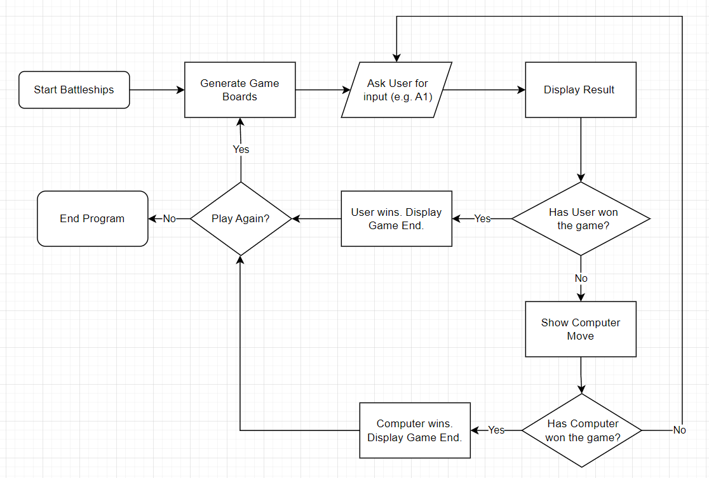
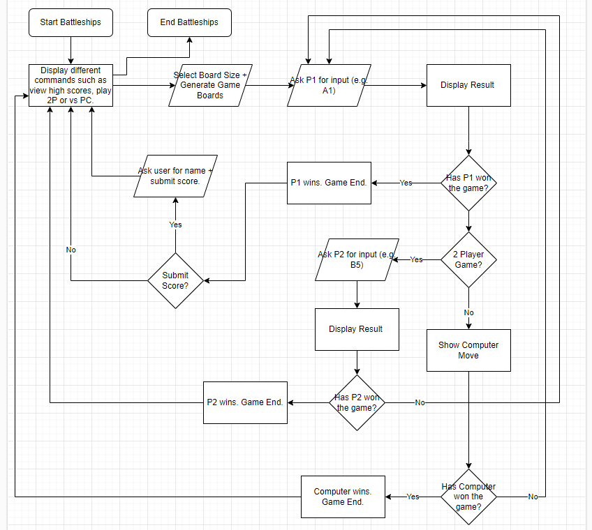
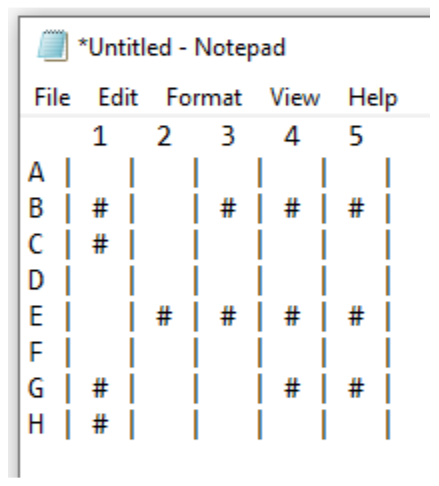
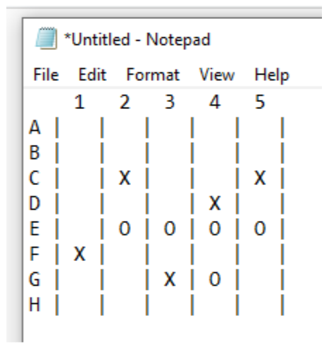
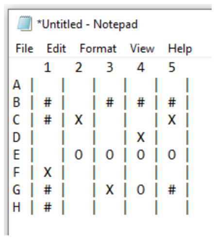

# Battleships Bonanza

Battleships Bonanza is a terminal-based game where users can play a game of battleships.

Developed by Patrick Vieira

## [Contents](#contents)

* [User Experience](#user-experience)
  * [Key Project Goals](#key-project-goals)
  * [Target Audience](#target-audience)
  * [User Goals](#user-goals)
  * [User Story](#user-story)
* [Planning](#planning)
  * [Strategy](#strategy)
  * [Scope](#scope)
  * [Structure](#structure)
  * [Skeleton](#skeleton)
  * [Surface](#surface)
* [Technology](#technology)
  * [Languages](#languages)
* [Design](#design)
  * [UX Considerations](#ux-considerations)
  * [Wireframes](#wireframes)
* [Features](#features)
  * [Welcome Message](#welcome-message)
  * [Main Menu](#main-menu)
  * [Play Game](#play-game)
  * [Board Size Selection](#board-size-selection)
  * [Battleship Assignment Method](#battleship-assignment-method)
  * [Random Assignment](#random-assignment)
  * [Manual Assignment](#manual-assignment)
  * [Main Game Loop](#main-game-loop)
  * [Check Win Condition](#check-win-condition)
  * [Game Over](#game-over)
  * [Play Again](#play-again)
  * [Future Features](#future-features)
* [Testing](#testing)
* [Deployment](#deployment)
* [Credits](#credits)

## User Experience

### Key Project Goals

1. Create a functional battleships game which ends once all battleships have sunk.
2. Create a feature which allows the user to set the game board size.
3. Create a feature that assigns random locations for battleships of different sizes.
4. Create a feature which allows the user to place ships on the board manually.
5. Create a feature which allows the user to view and submit high scores.

### Target Audience

A typical user will want to play a logic based game against a computer.

### User Goals

- Have fun playing a logic based terminal game.

### User Story

- User runs the program.
- User reads welcome message and understands what they can do at the main menu.
- User types in "play" to play the game.
- User reads the instructions for the next part and understands they can choose from a 4x4 grid up to a 9x9 grid.
- User enters the number "4".
- User reads the next instructions and understands they can choose between a random assignment of battleships or place their own.
- User wants to place their own battleships and so enters "manual".
- User reads instructions on how to place battleships on the grid and understands.
- User decides to place the Zurvan battleship starting at B2 and so enters "B2".
- User then follows the instructions and enters "v" to place the Zurvan vertically downwards from B2.
- User then places the first Sephirot battleship at C4 horizontally to the right by entering "C4" and then "h".
- User then places the next Sephirot battleship at D2 vertically upwards by entering "D2", then "v", then "u".
- User then reads the instructions on how to deploy bombs on the enemy battleship and enters "a1" for their first guess.
- User sees that they missed, but computer hits - they hit D1.
- User enters "b2". Hit. Computer also hits user at B3.
- User enters "b1", but it misses. Computer also misses by deploying at A2.
- User enters "a2", and that's a hit. Computer misses at C1.
- User enters "c2" which hits. Computer misses again at A1.
- User enters "d2" which misses. Computer also misses at A4.
- User enters "c1" which hits. Computer misses again at D3.
- User enters "c3" which hits. Computer misses again at B1.
- User enters "c4" which misses. Computer also misses at C2.
- User enters "d1" which misses. Computer hits this time at D2.
- User enters "b3" which hits. Computer also hits at B2.
- User enters "d3" which misses. Computer hits again at B4.
- User enters "a3" which hits. This triggers the win condition. User wins.
- User then reads the "Game Over" text and the following instructions.
- User types "main" to go back to the main menu and then "exit" to exit the game.

## Planning

### Strategy

---
| **Opportunity / Problem** | **Importance** | **Viability / Feasibility** | **Difficulty** |
|-----------------------------|:-:|:-:|:-:|
| Generate bame boards | 5 | 5 | 1 |
| Validate user inputs | 5 | 5 | 1 |
| Check win condition | 5 | 5 | 1 |
| Have Computer select random cell | 4 | 5 | 2 |
| Multiple game modes | 2 | 5 | 2 |
| Multiple board sizes | 1 | 4 | 3 |
| Record Score on Google Sheets | 2 | 4 | 3 |
| Generate boards with different sized ships | 2 | 4 | 4 |
| User to define battleship placement | 3 | 4 | 5 |
| Include welcome message | 4 | 5 | 1 |
| Alow user to view Leaderboard | 3 | 3 | 3 |
---

### Scope

All features can be included but implementation will be a gradual process. First, these will be prioritised:
- Generate game boards
- Validate user inputs
- Check win condition
- Have computer select random cell

Once these have been implemented, production will then work on these features in the following order:

1. Welcome Message
2. Multiple board sizes
3. Generate boards with different sized battleships
4. User to define battleship placement
5. Record Score on Google Sheets
6. Allow user to view Leaderboard
7. Multiple game modes

### Structure

Two different flow charts were created for this project. One was simpler and only included the first four features. The more complex version implements all fatures.

### Skeleton

The Skeleton Frame involves a mockup of how things would look to the user. As the terminal shares the same typography as microsoft notepad, Notepad was used to show a mockup of how the user will see the game board.

User Battleship Placements:

Computer Deployments:

User Board:

### Surface

As the surface is exclusively limited to the terminal, only a small amount can be said regarding this section.

- User instructions and displaying of game boards will be adequately spaced out for readability.
- Instructions will be given in a concise manner throughout the game.

## Technology

### Languages

As this project is based off a Code Institute template, there are various languages utilised in order to get rum.py to show in a browser.

However, the only code I have written is in Python, located in run.py of the root directory.

## Design

### UX Considerations

### wireframes

## Features

### Welcome Message

### Main Menu

### Play Game

### Board Size Selection

### Battleship Assignment Method

### Random Assignment

### Manual Assignment

### Main Game Loop

### Check Win Condition

### Game Over

### Play Again

### Future Features

## Testing

## Deployment

## Credits