# Battleships Bonanza

Battleships Bonanza is a terminal-based game where users can play a game of battleships.

[This project is now live on Render](https://battleships-bonanza.onrender.com)

Developed by Patrick Vieira

## [Contents](#contents)

* [User Experience](#user-experience)
  * [Key Project Goals](#key-project-goals)
  * [Target Audience](#target-audience)
  * [User Goals](#user-goals)
  * [User Story](#user-story)
* [Planning](#planning)
  * [Strategy](#strategy)
  * [Scope](#scope)
  * [Structure](#structure)
  * [Skeleton](#skeleton)
  * [Surface](#surface)
* [Technology](#technology)
  * [Languages](#languages)
* [Design](#design)
  * [UX Considerations](#ux-considerations)
* [Features](#features)
  * [Welcome Message](#welcome-message)
  * [Main Menu](#main-menu)
  * [Board Size Selection](#board-size-selection)
  * [Battleship Assignment Method](#battleship-assignment-method)
  * [Random Assignment](#random-assignment)
  * [Manual Assignment](#manual-assignment)
  * [Main Game Loop](#main-game-loop)
  * [Game Over](#game-over)
  * [Exit](#exit)
  * [Features to be Added](#features-to-be-added)
  * [Future Features](#future-features)
* [Testing](#testing)
* [Deployment](#deployment)
* [Credits](#credits)

## User Experience

### Key Project Goals

1. Create a functional battleships game which ends once all battleships have sunk.
2. Create a feature which allows the user to set the game board size.
3. Create a feature that assigns random locations for battleships of different sizes.
4. Create a feature which allows the user to place ships on the board manually.
5. Create a feature which allows the user to view and submit high scores.

### Target Audience

A typical user will want to play a logic based game against a computer.

### User Goals

- Have fun playing a logic based terminal game.

### User Story

- User runs the program.
- User reads welcome message and understands what they can do at the main menu.
- User types in "play" to play the game.
- User reads the instructions for the next part and understands they can choose from a 4x4 grid up to a 9x9 grid.
- User enters the number "4".
- User reads the next instructions and understands they can choose between a random assignment of battleships or place their own.
- User wants to place their own battleships and so enters "manual".
- User reads instructions on how to place battleships on the grid and understands.
- User decides to place the Zurvan battleship starting at B2 and so enters "B2".
- User then follows the instructions and enters "v" to place the Zurvan vertically downwards from B2.
- User then places the first Sephirot battleship at C4 horizontally to the right by entering "C4" and then "h".
- User then places the next Sephirot battleship at D2 vertically upwards by entering "D2", then "v", then "u".
- User then reads the instructions on how to deploy bombs on the enemy battleship and enters "a1" for their first guess.
- User sees that they missed, but computer hits - they hit D1.
- User enters "b2". Hit. Computer also hits user at B3.
- User enters "b1", but it misses. Computer also misses by deploying at A2.
- User enters "a2", and that's a hit. Computer misses at C1.
- User enters "c2" which hits. Computer misses again at A1.
- User enters "d2" which misses. Computer also misses at A4.
- User enters "c1" which hits. Computer misses again at D3.
- User enters "c3" which hits. Computer misses again at B1.
- User enters "c4" which misses. Computer also misses at C2.
- User enters "d1" which misses. Computer hits this time at D2.
- User enters "b3" which hits. Computer also hits at B2.
- User enters "d3" which misses. Computer hits again at B4.
- User enters "a3" which hits. This triggers the win condition. User wins.
- User then reads the "Game Over" text and the following instructions.
- User types "main" to go back to the main menu and then "exit" to exit the game.

## Planning

### Strategy

---
| **Opportunity / Problem** | **Importance** | **Viability / Feasibility** | **Difficulty** |
|-----------------------------|:-:|:-:|:-:|
| Generate bame boards | 5 | 5 | 1 |
| Validate user inputs | 5 | 5 | 1 |
| Check win condition | 5 | 5 | 1 |
| Have Computer select random cell | 4 | 5 | 2 |
| Multiple game modes | 2 | 5 | 2 |
| Multiple board sizes | 1 | 4 | 3 |
| Record Score on Google Sheets | 2 | 4 | 3 |
| Generate boards with different sized ships | 2 | 4 | 4 |
| User to define battleship placement | 3 | 4 | 5 |
| Include welcome message | 4 | 5 | 1 |
| Alow user to view Leaderboard | 3 | 3 | 3 |
---

### Scope

All features can be included but implementation will be a gradual process. First, these will be prioritised:
- Generate game boards
- Validate user inputs
- Check win condition
- Have computer select random cell

Once these have been implemented, production will then work on these features in the following order:

1. Welcome Message
2. Multiple board sizes
3. Generate boards with different sized battleships
4. User to define battleship placement
5. Record Score on Google Sheets
6. Allow user to view Leaderboard
7. Multiple game modes

### Structure

Two different flow charts were created for this project. One was simpler and only included the first four features. The more complex version implements all fatures.

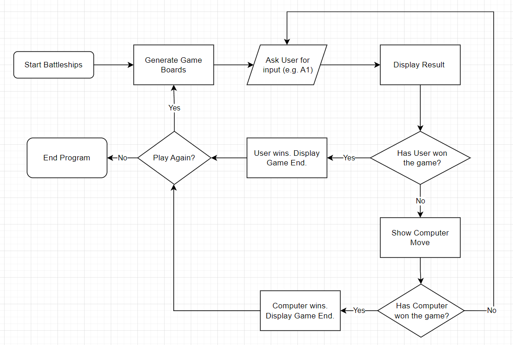

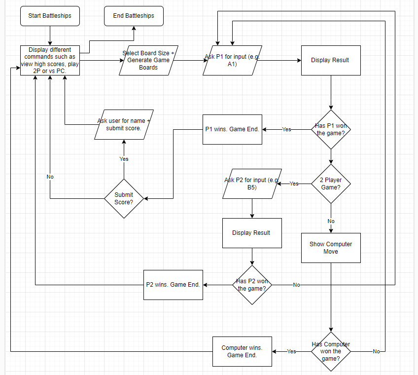

### Skeleton

The Skeleton Frame involves a mockup of how things would look to the user. As the terminal shares the same typography as microsoft notepad, Notepad was used to show a mockup of how the user will see the game board.

User Battleship Placements:

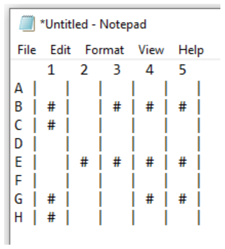

Computer Deployments:

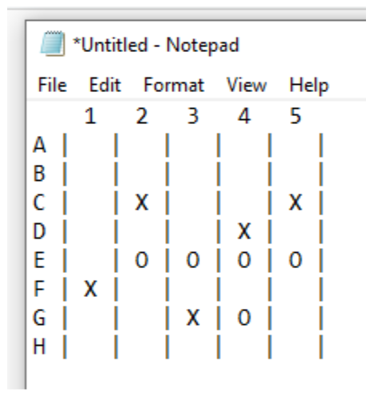

User Board:

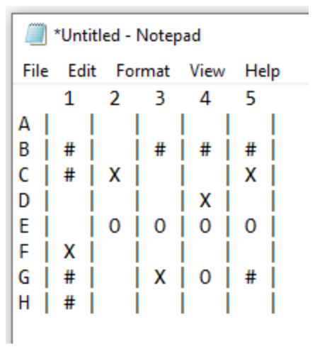

### Surface

As the surface is exclusively limited to the terminal, only a small amount can be said regarding this section.

- User instructions and displaying of game boards will be adequately spaced out for readability.
- Instructions will be given in a concise manner throughout the game.

## Technology

### Languages

As this project is based off a Code Institute template, there are various languages utilised in order to get rum.py to show in a browser.

However, the only code I have written is in Python, located in run.py of the root directory.

## Design

### UX Considerations

At certain points during the game, the user is presented with a lot of information all at once. In order to space this out for the user to be able to take everything in, I have implemented several points where the user needs to press the enter key to continue to the next section.

I have also implemented very large spacings between sections so that it is clear to the user what part is new. An ideal situation would have been to change to code so that every print message has a slight delay, allowing the user to see the progression of text. However, this would have made my code very messy and I think the large spacings are a good alternative.

## Features

### Welcome Message

The program first begins with a message which welcomes the user to the game. A brief description of the game is given as well as an explanation of some features such as being able to specify board size and placing battleships manually.

The user is instructed to press enter.

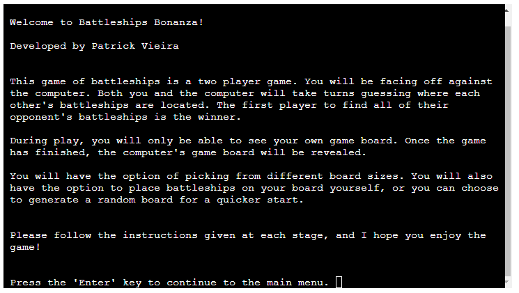

### Main Menu

Upon pressing enter, the Main Menu is displayed. The user has the option to enter two commands, 'play' or 'exit'. User input is validated and only accepts these two commands. If anything else is entered, the program will return an error message and ask for the user to try again.

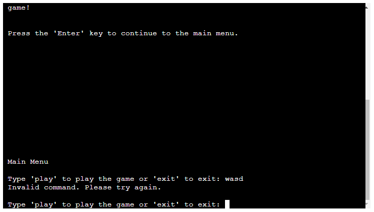

### Board Size Selection

Upon entering 'play', the Board Size Selection instructions will be displayed. The user is then encouraged to enter a number from 4 to 9. If the user does not enter a number between 4 and 9, an error message will show and will be asked the question again.

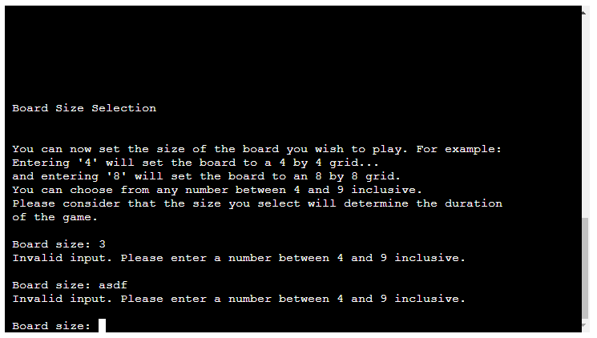

### Battleship Assignment Method

Upon entering a valid board size, the next section will be displayed which is to decide how battleships will be placed on the user's board. The user has the option to ask the computer to give a random assignment of battleships or to place them manually on the board. If the entered string does not match either 'r' or 'm', an error will be thrown and user will be prompted again.

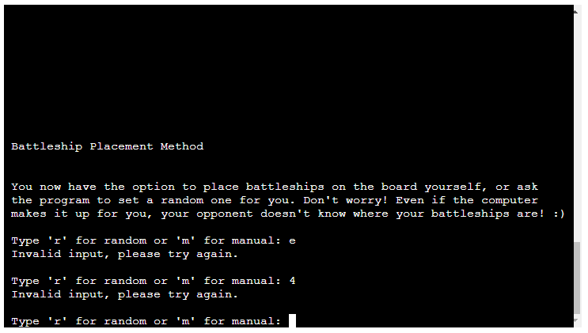

### Random Assignment

If the user decides to let the computer assign random positions for their battlehsips, this will be completed automatically behind the scenes.

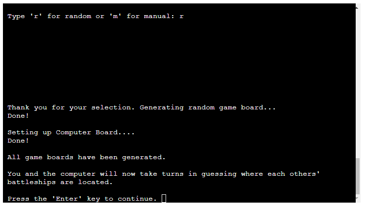

### Manual Assignment

If the user decides to place battleships on the board themselves, they will be shown the instructions for the section. Upon pressing enter, they will be able to begin assigning positions.

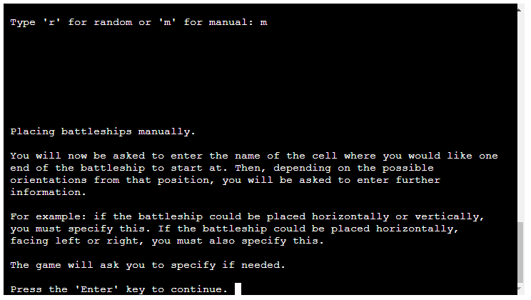

The current board will be displayed, along with a list of all the cells where the end of the current battleship can be positioned.

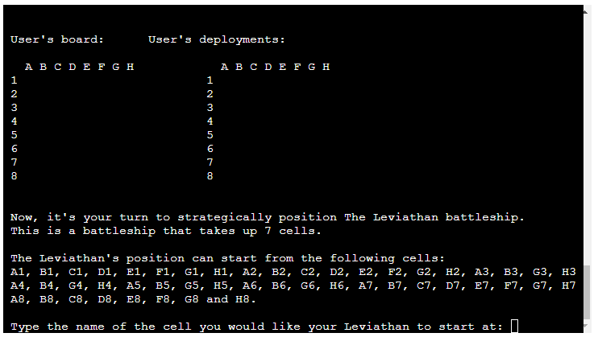

User input is fully validated as only the available cells shown in the terminal are valid. If the user enters anything but the cells shown in the terminal, the program will throw an error and the user will be asked again for input.

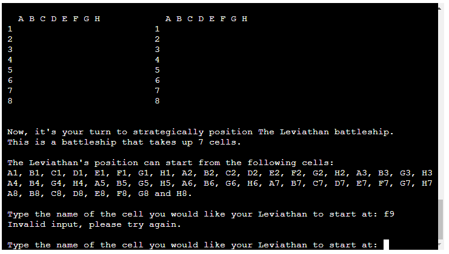

If the user is able to place the end of the battleship on a cell but with different orientations, the user will be prompted to specify. This input is also fully validated. Several examples are shown:

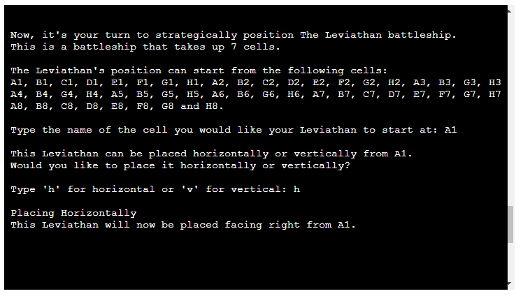

[Options for Zurvan Battleship](./static/images/features/manual-placement-zurv-options.png)

[Options for Sephirot Battleship](./static/images/features/manual-placement-seph-options.png)

Once the process is complete and all battleships have been placed on the board, a message will be displayed and the user will be asked to press Enter to continue. This takes the user to the Main Game Loop.

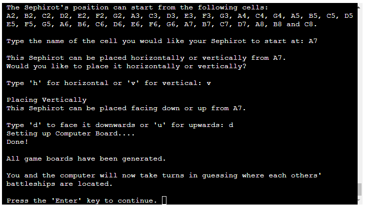

### Main Game Loop

The Main Game Loop is where the game happens. The user and the computer take turns in deploying bombs onto cells in the opponent's field until one field is void of battlehsips.

The user's board and deployments are shown. The user is then prompted for the cell they wish to attack. This input is fully vaildated, and the user is given lots of information regarding the required format of their input.

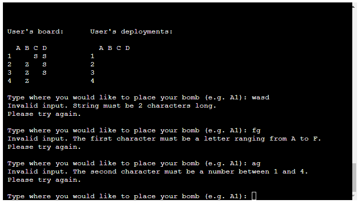

Every time the user or the computer decides on a cell to attack, the program checks whether any other battleships are left on the opponent's board. If there are, play will continue. If not, then it is Game Over.

### Game Over

Once the win condition has been triggered, both the user's and computer's game boards will be displayed along with a 'Game Over' message.

The user is then presented with some options. Whether to play again, return to the main menu, or exit.

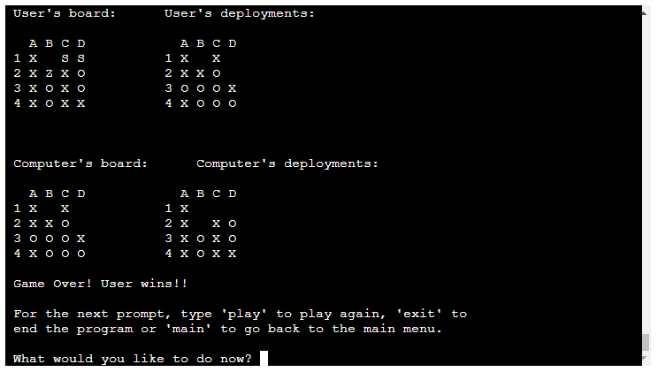

### Exit

Upon typing 'exit', the program will run a sys.exit() function which terminates the program.

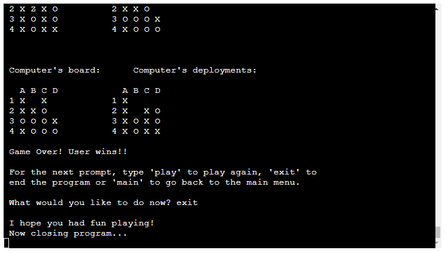

### Features to be Added

1. Google Sheets Leaderboard
2. Multiple Game Modes

A Google API can be implemented so that run.py can connect with a Google Sheets Document. The idea behind this is for users to be able to submit high scores when they beat the computer along with a name. The user will then be able to view some high scores from the main menu.

A 2-player mode could be implemented where both users are humans. This could be done making use of input() functions to allow users to turn away from their screen while their opponent makes their move.

These features are missing as I ran out of time to implement them in working order.

Additionally, the Battleship class has an unused attribute that I added toward sthe tail-end of developement called "compatible_boards". The intention behind this is I wanted to use this to make my code more efficient. When I created the random_battlehsip_placement function (from the Player class), I had not yest created the Battleship class so the intention was to condense my code and reuse functions. However, I ran out of time.

### Future Features

1. Intelligent Computer Decisions
2. Varying Game Difficulties

A more intricate algorithm could be implemented for the comupter to make decisions on where to strike next based on their own deployemnts board.

Using this concept, varying game difficulties could be implemented where the original function would be used for the lowest difficulty, and the more intricate algorithm could be used for the higher difficulty.

## Testing

1. Manual Testing
2. User Testing
3. PEP8 Linter

Manual testing was done throughout the process of development. Every implemented feature works as intended. Because of the number of permutations the battleships can take, especially on the larger sized boards, manual testing was not exhaustive, but rather, focused on basic functionality.

For example, implementing the function which turns my two letter string containing the cell name into a coordinate referring to its position in the nested list... This was tested by entering different inputs. As the inputs get validated before calling that function, there was no need include that functionality in the function and instead focus on only calling it on processed data. As a result, no errors were thrown.

User testing was done with 3 human testers not including myself. Thye each followed instructions carefully, however one player did make the mistake of selecting a cell they had already done. They did this a couple of times and as a result lost to the computer. This is an intended design choice because it should be down to the skill of the player to read and understand the game board.

A PEP8 Linter from Code Institute was used in order to check for good Python coding practices. This ensured there was no trailing whitespace, ambiguous intendations or lines over 79 characters long.

## Deployment

This project was deployed on render.

The deployment process was as follows:

1. Log in to render.com
2. Click "New +"
3. Click "Web Service"
4. Search for the repository to deploy and click "Connect"
5. Add a Name for the web service
6. Ensure 'Evironment' is set to 'Python 3'
7. Ensure 'Region' is set to 'Frankfurt (EU Central)
8. Ensure 'Branch' is set to 'main'
9. Set the Build Command to 'pip install -r requirements.txt && npm install
10. Set the Start Command to 'node index.js'
11. Ensure the 'free' plan is selected.
12. Click on 'Advanced' and then 'Add Environment Variable'
13. Enter the key 'PORT' with a value of '8000'
14. Enter the key 'PYTHON_VERSION' with a value of '3.10.7'
15. Set 'Auto-Deploy' to 'Yes'
16. Click 'Create Web Service'

Once deployment is complete, the provided link will allow anyone to visit the deployed project.

## Credits

Thank you to Code Institute for providing the template used for this project and for also providing the [linter](https://pep8ci.herokuapp.com/#) used to test it.

Thank you to 'Geeks for Geeks' for their [article on nested list comprehensions](https://www.geeksforgeeks.org/nested-list-comprehensions-in-python/) which helped me condense my code. 